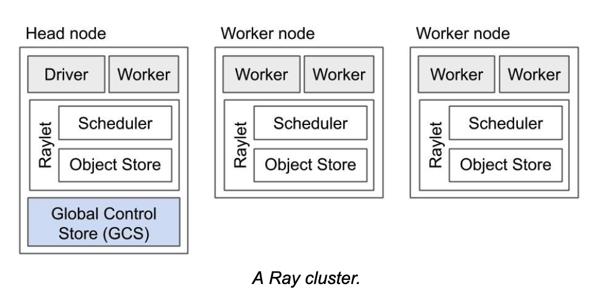
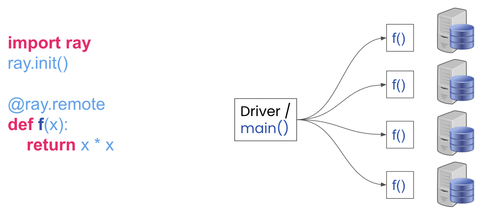
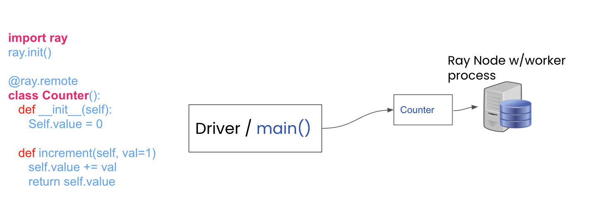

# Key concepts and terms
Like any new framework, especially a distributed one, Ray has many concepts and terms you will want to get

familiar as you dive deeper in its user guide, understand terms used in [getting started with Ray](index.md)

## Ray cluster



**Head node**
Any worker node can be a head node, but Ray designates one of worker as a head node as the one on which a`driver` runs.
In addition, a head node also is runs the global control store.

**Global Control Store (GCS)**
There is only a single instance of GCS, which only runs as process on the head node. It's a key-value store
that contains system-level metadata, such as the locations of objects and actors, etc.

**Worker node**
A Ray instance consists of one or more worker nodes, each of which consists of the following physical processes:
 
**Raylet**: A raylet is shared among all jobs on the same cluster. That is other nodes on can talk and communicate 
with it. In turn the raylet has two main components, run on separate threads:

 1: **Scheduler**: It is responsible for resource management and fulfilling task arguments that are stored in the distributed object store. The individual schedulers in a cluster comprise the Ray distributed scheduler
 2: **Object store**: A shared-memory object store (also known as the Plasma Object Store). It is responsible for storing and transferring large objects. The individual object stores in a cluster comprise the Ray distributed object store.


## Ray core basics

**Ray Application** <br>
A program including a Ray script that calls `ray.init()` and uses Ray programing primitives such as`tasks`, `actors`, and Ray APIs such as
`ray.get()`, `ray.put()`, and `ray.wait()` which can be executed  locally or remotely on a Ray cluster. Also called the `driver`, this
script can be executed anywhere on the cluster or locally and connected to the cluster, via `ray.init(address=ray:URI)`. 

**Ray Job**
It is a collection of tasks, objects, and actors originating (recursively) from the same `driver`.


**Tasks (Remote functions)** <br>
Tasks (remote functions) are asynchronous Ray functions. Ray enables arbitrary functions to be executed asynchronously on a cluster as show in the diagram. Any arbitrary
Python function can be converted into a remote Ray task by decorating it with the `ray.remote()` decorator. 
```
import ray
@ray.remote

@ray.remote
def f(x):
    return x * x
```




**Actors (Remote Classes)** <br>
An actor is essentially a stateful worker (or a service). When a new actor is instantiated, a new worker process is created on the Ray cluster node where the actor is
bound to. Methods of the actor are scheduled on that specific worker process on that node in the cluster. This worker process and can access and mutate the state 
of that actor service.

```
import ray
ray.init()

@ray.remote
class Counter():
   def __init__(self):
      Self.value = 0
   
   def increment(self, val=1)
      self.value += val
      return self.value

counter = Counter.remote()
object_ref = counter.increment.remote()
assert ray.get(object_ref) == 1`
object_ref2 = counter.increment.remote(5)
assert ray.get(object_ref2) == 6
```


**Remote objects** <br>
In Ray, we can create and compute on objects. We refer to these objects as remote objects. Remote objects are stored on the node that creates an object or returns
an object from a task. For example, 

```
val = 10 * 10
object_ref = ray.put(val)
```
If this code is executed in the `driver` then the `object_ref` will be stored or located on the node where the driver is run. In contrast, if this code is
executed in a remote task in a function, then the node on which the task was executed owns the object ref.

```
@ray.remote
def f():
    val = 10 * 10
    return val
```

**Object refs** <br>
We use object refs to refer to remote objects. They are unique.
```
import ray
val = 10 * 10
object_ref = ray.put(val)
print(object_ref)

ObjectRef(ffffffffffffffffffffffffffffffffffffffff0100000001000000)

obj_ref = f.remote()
print(obj_ref)
ObjectRef(a67dc375e60ddd1affffffffffffffffffffffff0100000001000000)
```

The value of an object can be resolved using an `ObjectRef`. The `ObjectRef` comprises two fields:
 1. A unique 20-byte identifier. This is a concatenation of the ID of the task that produced the object and the integer number of objects created by that task so far. 
 2. The address of the object’s owner (a worker process). This consists of the worker process’s unique ID, IP address and port, and local **Raylet’s** unique ID.

**Dependencies or Environment** <br>
Anything outside of the Ray script that your application or job needs to run, including files, packages, and environment variables.

**Files**  <br>
Code files, data files or other files that your Ray application needs to run.

**Packages** <br>
External libraries or executables required by your Ray application, often installed via pip or conda.

**Runtime Environments** <br>
A runtime environment describes the dependencies your Ray application needs to run, including files, packages, environment variables, and more. It is installed dynamically on the cluster at runtime.


## Running Ray
**Ray runtime** <br>
Ray programs are able to parallelize and distribute by leveraging an underlying Ray runtime. The Ray runtime consists of multiple services/processes started in the background for communication, data transfer, scheduling, and more. The Ray runtime can be started on a laptop, a single server, or multiple servers.

**Ray client** <br>
The Ray Client is an API that connects a Python script to a remote Ray cluster. Effectively, it allows you to leverage a remote Ray cluster just like you would with Ray running on your local machine.

**Local machine and Cluster** <br>
The recommended way to connect to a remote Ray cluster is to use Ray Client, and we will call the machine running Ray Client your local machine.

**Driver** <br>
An entry point of Ray applications that calls `ray.init(address=’auto’)` or `ray.init()` 

**Job** <br>
A period of execution between connecting to a cluster with `ray.init()` and disconnecting by calling `ray.shutdown()` or exiting the Ray script.

**Namespace** <br>
A namespace is a logical grouping of jobs and named actors. When an actor is named, its name must be unique 
within the namespace. For example,
```
# Create an actor with a name
counter = Counter.options(name="some_name").remote()
```
### Placement groups
**Bundle** <br>
A bundle is a collection of “resources”, i.e. {“GPU”: 4}. A bundle must be able to fit on a single node on the Ray cluster. Bundles are then placed according to the “placement group strategy” across nodes on the cluster.

**Placement group** <br>
A placement group is a collection of bundles.

**Placement group strategy** <br>
A placement group strategy is an algorithm for selecting nodes for bundle placement. Read more about placement strategies.


## Advanced concepts

**Serialization and Deserialization** <br>
serialization or serialization is the process of translating a data structure or object state into a format that can be stored or transmitted and reconstructed later. The opposite operation, extracting a data structure from a series of bytes, is deserialization.

### Memory
#### Ray system memory: memory used internally by Ray

**Redis** <br>
memory used for storing the list of nodes and actors present in the cluster. The amount of memory used for these purposes is typically quite small.

**Raylet** <br>
memory used by the C++ raylet process running on each node. This cannot be controlled, but is typically quite small.

#### Application memory: memory used by your application

**Worker heap** <br>
memory used by your application (e.g., in Python code or TensorFlow), best measured as the resident set size (RSS) of your application minus its shared memory usage (SHR) in commands such as top. The reason you need to subtract SHR is that object store shared memory is reported by the OS as shared with each worker. Not subtracting SHR will result in double counting memory usage.

**Object store memory** <br>
Memory used when your application creates objects in the object store via `ray.put` and when 
returning values from remote functions. Objects are reference counted and evicted when they 
fall out of scope. There is an object store server running on each node. In Ray 1.3+, objects will be spilled to 
disk if the object store fills up.

**Object store shared memory** <br>
Memory used when your application reads objects via `ray.get`. Note that if an object is already 
present on the node, this does not cause additional allocations. This allows large objects to be 
efficiently shared among many actors and tasks.


